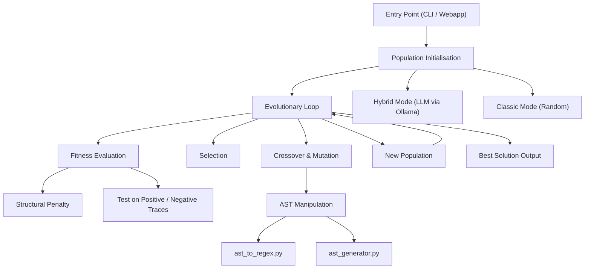

# Architecture: Genetic Algorithm for Regex Synthesis

## Introduction
This project implements an advanced genetic algorithm for the automatic synthesis
of regular expressions. The goal is to find regex patterns that effectively
discriminate between positive and negative example strings. The architecture
is designed to maximise modularity, extensibility, and experimental reproducibility.

## High-Level Overview



## Module Overview

| Module | Responsibility |
|---|---|
| `data_simulation` | Ground-truth regex generation; positive/negative trace synthesis |
| `syntactic_representation` | LALR(1) parser (regex → AST) and inverse compiler (AST → regex) |
| `evolutionary_engine` | Full GA loop: initialisation, fitness, selection, crossover, mutation |
| `benchmarking` | Automated multi-run experiments; CSV logging; comparison plots |
| `webapp` | Flask backend + browser UI for interactive runs |

## Engineering Pipeline

### 1. Parameter Definition & Input
- The user configures population size, number of generations, mutation probability,
  elite percentage, and initialisation mode (classic or hybrid).
- Positive and negative examples are loaded from files or generated automatically.

### 2. Population Initialisation
- **Classic mode**: valid regex strings are generated randomly via `regex_generator.py`.
- **Hybrid mode**: an LLM (Ollama `phi3:mini`) is prompted with example traces to
  produce semantically informed candidates; random individuals fill the remainder.

### 3. Evolutionary Loop
For each generation:
- **Fitness evaluation** – each individual is tested against positive/negative traces
  and penalised for structural over-generalisation (wildcards, nested quantifiers, etc.).
- **Selection** – individuals are ranked by fitness; the elite fraction is preserved.
- **Crossover** – homologous AST sub-trees are swapped between two parents.
- **Mutation** – random type-safe modifications are applied to the offspring AST
  (character substitution, escape-class change, quantifier addition/removal).
- **Replacement** – the new population replaces the previous one; the elite is kept.

### 4. Output & Analysis
- The best regex found is returned with its fitness score and detailed info dict.
- Per-generation history is written to JSON for downstream analysis and plotting.

## Pseudocode

```
GeneticAlgorithm():
    params          ← ConfigureParams()
    good, bad       ← LoadTraces()
    population      ← InitPopulation(params, good, bad)
    for gen in 1..N:
        fitness     ← EvaluateFitness(population, good, bad)
        elite       ← SelectElite(population, fitness)
        offspring   ← CrossoverMutate(elite, params)
        population  ← UpdatePopulation(elite, offspring)
    best            ← ExtractBest(population)
    Output(best)
```

## Modularity & Extensibility
- Each phase is encapsulated in a separate module, enabling easy replacement of the
  fitness function, selection strategy, or genetic operators.
- The pipeline supports external LLM integration for population seeding.
- A deterministic random seed ensures experiment reproducibility.
