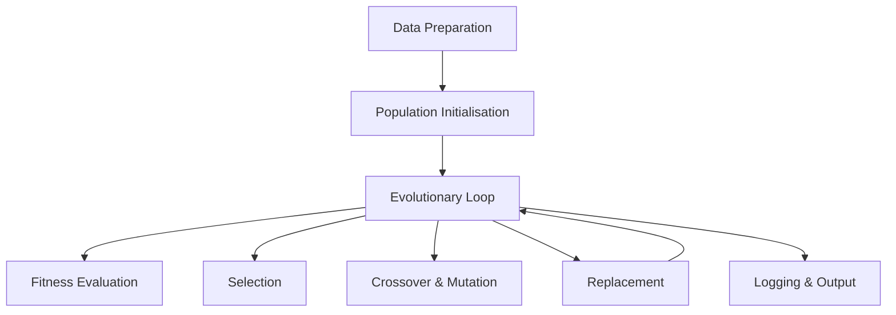

# Engineering Pipeline: Genetic Algorithm for Regex Synthesis

## Introduction
The engineering pipeline is designed for robustness, modularity, and ease of
experimentation. Each phase is implemented as an independent module, ensuring
traceability and reproducibility of results.

## Pipeline Stages

### 1. Data Preparation
- Generation or loading of positive and negative example strings.
- Automatic trace classification via dedicated modules.
- Data is organised in structured per-experiment directories.

### 2. Population Initialisation
- Random generation of syntactically valid regex via `regex_generator.py`.
- Alternative hybrid initialisation via LLM with dynamically built prompts.
- Regex strings are converted to ASTs for safe evolutionary manipulation.

### 3. Evolutionary Loop

**Fitness Evaluation**
- Regex is compiled and full-matched against positive/negative traces.
- Structural penalties are computed (length, wildcards, char classes, etc.).
- Bonus score awarded for desirable literal substrings.

**Selection**
- Individuals are sorted by fitness; the top elite fraction is preserved.
- Stochastic mechanisms (weighted sampling) maintain genetic diversity.

**Crossover & Mutation**
- Direct AST manipulation to produce offspring.
- Conservative crossover avoids nested quantifiers and unsafe node types.
- Type-safe mutation: character substitution, escape-class change, quantifier toggle.

**Replacement**
- New population assembled from elite + offspring + random immigrants.
- Mutation probability decays linearly over generations.

### 4. Logging & Output
- Results saved to CSV for each experiment run.
- Detailed logging of parameters, fitness scores, execution times, and best regex.
- Analysis scripts for plotting, statistics, and method comparison.

## Pipeline Diagram



## Detailed Pseudocode

```
GeneticAlgorithmPipeline():
    dataset         ← PrepareData()
    population      ← InitPopulation(dataset)
    for gen in 1..N:
        fitness     ← EvaluateFitness(population, dataset)
        elite       ← SelectElite(population, fitness)
        offspring   ← CrossoverMutate(elite)
        population  ← UpdatePopulation(elite, offspring)
        LogGeneration(population, fitness)
    SaveResults(population)
    VisualiseStatistics()
```

## Engineering Best Practices
- Clear separation between evolutionary logic and data management.
- Deterministic seeds for full experiment reproducibility.
- Structured logging with automatic result persistence.
- Modular design to easily test alternative strategies and operators.
